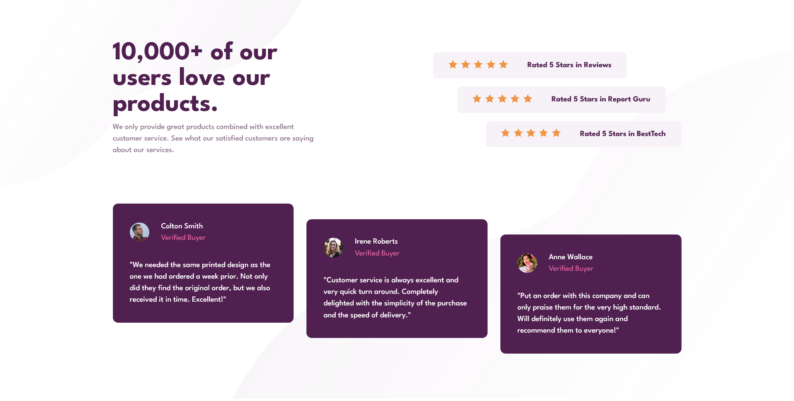

# Social Proof Section

## Links
- [Challenge Link](https://www.frontendmentor.io/challenges/social-proof-section-6e0qTv_bA)
- [Site Preview](https://robinjmm-social-proof-section.netlify.app/)

## About
This is my solution for challenge of building a social proof section from [Frontendmentor.io](https://frontendmentor.io). This is also my third challenge completed.

My goal for this challenge was to re-create a mock with a more challenging layout. The layout changes between small and large viewports were a bit tricky and provided a tough challenge for my current skills. 

I managed to complete the challenge, but I'm not confident I wrote the best possible solution. If you have any feedback and advice on how to improve my code, please feel free to do so.

## Built with
- Semantic HTML5
- CSS
- Flexbox
- Sass preprocessor

## Acknowledgements
I'm very grateful to [Frontendmentor.io](https://frontendmentor.io) for providing designs and challenges that helps me improve my skills as a web developer.
